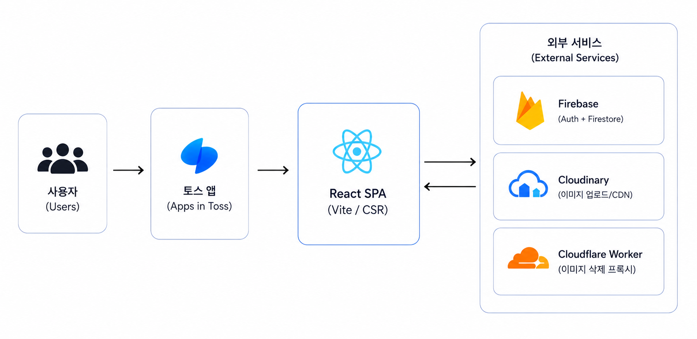

# 띵돈 (Ddingdone)
앱인토스 미니앱으로 출시 후 실제 사용자 피드백을 반영하며 개선한 모임 정산 서비스

## 📜목차

- [프로젝트 소개](#프로젝트-소개)
- [기술 스택](#기술-스택)
- [배포 구조](#배포-구조)
- [아키텍처](#아키텍처)
- [트러블 슈팅](#트러블-슈팅)

## 🙋‍♂️프로젝트 소개


띵돈은 친구들과의 여행, 식사, 회식처럼 여러 사람이 함께한 모임의 비용을 간편하게 기록하고 정산하는 서비스입니다. 모임을 만든 뒤 초대 링크를 공유하면 참여자들이 자신이 결제한 내역을 직접 추가할 수 있으며 변경 사항은 실시간으로 동기화됩니다.

계산된 결과에서는 토스 송금 딥링크를 이용해 실제 송금 단계까지 자연스럽게 이어갈 수 있습니다. 모임별 대표 사진도 함께 저장해 지난 모임의 기록을 한눈에 확인할 수 있습니다.

주요 기능은 다음과 같습니다.

- 모임 생성 및 초대 링크 공유
- 참여자별 지출 내역 등록과 실시간 동기화
- 토스 송금 딥링크 연결
- 모임 대표 사진 업로드 및 관리
- 참여한 모임과 정산 내역 조회

## 🛠️기술 스택

| 구분 | 기술 | 사용 목적 |
| --- | --- | --- |
| Frontend | React 18, TypeScript | 화면과 비즈니스 로직 구현 |
| Build | Vite, Granite, Apps in Toss Web Framework | 개발 환경 구성 및 앱인토스 빌드 |
| Routing | React Router | 페이지 라우팅 및 딥링크 처리 |
| State | Zustand | 사용자 인증 정보와 닉네임 관리 |
| UI | TDS Mobile, Emotion | 토스 디자인 시스템 기반 UI 구성 |
| Backend | Firebase Authentication, Cloud Firestore | 익명 인증, 모임 데이터 저장 및 실시간 동기화 |
| Security | Firestore Security Rules | 클라이언트 직접 접근 시 인증·멤버십·데이터 변경 범위 검증 |
| Image | Cloudinary | 모임 대표 사진 저장 및 이미지 변환 |
| Serverless | Cloudflare Workers | 인증된 Cloudinary 이미지 삭제 처리 |
| Test | Vitest, React DOM Test Utils, jsdom | 정산 로직, 유틸리티 및 구독 캐시 테스트 |
| Quality | ESLint, Prettier | 정적 분석 및 코드 스타일 관리 |

## 🌐배포 구조

```text
사용자
  └─ 토스 앱
      └─ 띵돈 미니앱 (Apps in Toss)
          ├─ Firebase Authentication ─ 익명 사용자 인증
          ├─ Firestore Security Rules ─ 요청 권한 및 데이터 무결성 검증
          │   └─ Cloud Firestore ─ 모임·멤버·지출 데이터 실시간 동기화
          ├─ Cloudinary ─ 대표 사진 업로드 및 전송
          └─ Cloudflare Worker ─ 사용자·모임 권한 검증 후 사진 삭제
```

프론트엔드는 `ait build`로 앱인토스 번들을 생성하고 `ait deploy`로 배포합니다. Firestore는 별도의 애플리케이션 서버 없이 데이터 저장소와 실시간 구독을 담당하며, 접근 권한은 Firebase Authentication과 Firestore Security Rules로 제어합니다.

Cloudinary 업로드는 클라이언트에서 수행하되, API Secret이 필요한 이미지 삭제는 Cloudflare Worker를 통해 처리합니다. Worker는 Firebase ID 토큰과 해당 모임의 멤버 여부, 이미지 소유 경로를 검증한 뒤 Cloudinary 삭제 API를 호출합니다.

## 🔄아키텍처



## 🚨트러블 슈팅

### Firestore 화면 전환 시 중복 읽기 문제

모임 상세, 비용 입력, 모임 수정 화면이 형제 라우트로 구성되어 있어 페이지를 이동할 때마다 컴포넌트가 다시 마운트되었습니다. 이 과정에서 `onSnapshot` 리스너가 반복 생성되고, 모임·멤버·지출 데이터를 매번 처음부터 읽어 Firestore 읽기 사용량이 불필요하게 증가했습니다.

모듈 레벨 캐시와 `useSyncExternalStore`를 이용해 동일한 모임 ID의 구독을 공유하도록 개선했습니다. 마지막 구독자가 화면을 떠나도 30초의 유예 시간을 두어 짧은 화면 이동에서는 기존 리스너를 재사용하고, 이후에는 정상적으로 해제되도록 참조 카운트를 적용했습니다. 대표 사용 시나리오 기준 예상 읽기 횟수는 75회에서 15회로 약 80% 감소했습니다.

### Firestore 클라이언트 직접 접근 보안 강화

별도의 백엔드 서버 없이 클라이언트가 Firestore에 직접 접근하는 구조에서는 화면의 버튼이나 입력값만 제한해도 개발자 도구나 변조된 요청으로 쓰기 작업을 우회할 수 있습니다. 따라서 모든 데이터 변경을 신뢰할 수 없는 클라이언트 요청으로 간주하고, Firestore Security Rules에서 권한과 데이터 무결성을 최종 검증하도록 구성했습니다.

모임 생성 시에는 요청자의 UID가 `createdBy`와 최초 `memberUids`에 정확히 반영되었는지 확인하고, 일반 수정에서는 `createdBy`, `memberUids`, `memberCount` 같은 권한 관련 필드의 임의 변경을 차단합니다. 참여와 나가기는 본인의 UID 하나만 추가·삭제되었는지 검증하며, 멤버 문서는 본인만 생성·수정할 수 있습니다. 지출 역시 정산 전의 실제 모임 멤버가 본인 명의로만 등록·수정·삭제할 수 있고, 모임 전체 삭제는 생성자에게만 허용합니다. 배치 작업에는 `getAfter()`를 사용해 변경 완료 후의 상태까지 함께 검증합니다.

이를 통해 클라이언트가 Firestore SDK나 REST API로 직접 요청하더라도 방장 권한 탈취, 다른 멤버 강제 퇴장, 가짜 멤버 삽입, 타인 명의 비용 등록과 같은 비정상 변경이 데이터베이스 계층에서 거부됩니다. 주요 공격 시나리오의 검증 결과는 [Firestore Security Rules 검증 기록](docs/SECURITY_RULES_TEST.md)에 정리했습니다.

### 고해상도 사진 업로드 지연 문제

스마트폰 카메라 원본을 가공 없이 Cloudinary로 전송하면서 수 MB 크기의 이미지가 그대로 업로드되어, 모바일 네트워크에서 저장 시간이 길어지는 문제가 있었습니다. 서버에서 이미지를 변환하는 방식은 다운로드 용량만 줄일 뿐 업로드 구간의 병목을 해결하지 못했습니다.

업로드 전에 브라우저의 Canvas API로 이미지의 긴 변을 최대 1600px로 축소하고 JPEG 품질을 0.82로 재압축했습니다. `createImageBitmap`에서 EXIF 방향을 반영해 세로 사진의 회전 문제를 방지했으며, 압축 실패 시에는 원본을 업로드하도록 폴백을 두었습니다. 4000×3000 테스트 이미지 기준 파일 크기는 3.96MB에서 486KB로 약 88% 감소했습니다.

자세한 원인 분석과 검증 과정은 [트러블슈팅 문서](docs/TROUBLESHOOTING.md)에서 확인할 수 있습니다.
